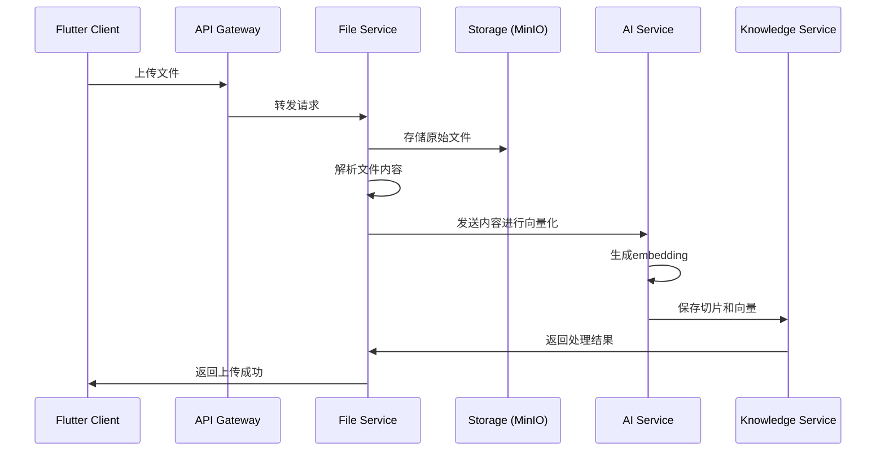
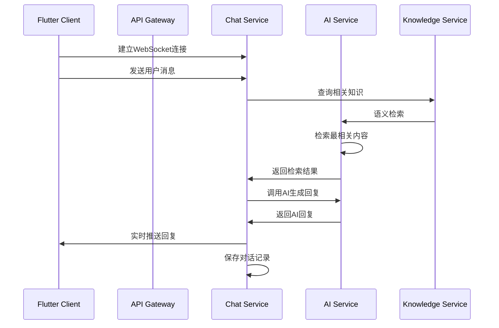

# XLoop 知识智能平台技术架构设计

## 1. 整体架构概览

XLoop 采用前后端分离的微服务架构，前端使用 Flutter 支持多平台部署，后端采用微服务架构，支持水平扩展和高可用部署。

```
┌─────────────────────────────────────────────────────────────┐
│                    客户端层 (Client Layer)                    │
├─────────────────────────────────────────────────────────────┤
│  Flutter Web  │  Flutter Mobile  │  Flutter Desktop        │
│  (Responsive) │  (iOS/Android)   │  (Windows/macOS/Linux)  │
└─────────────────────────────────────────────────────────────┘
                              │
                    ┌─────────┴─────────┐
                    │    API Gateway    │
                    │   (Kong/Traefik)  │
                    └─────────┬─────────┘
                              │
┌─────────────────────────────────────────────────────────────┐
│                   微服务层 (Service Layer)                   │
├─────────────────────────────────────────────────────────────┤
│ 用户服务 │ 知识库服务 │ 文件服务 │ AI服务 │ 对话服务 │ 调优服务 │
│ (Auth)  │ (Knowledge)│ (File)  │ (AI)  │ (Chat) │ (Tuning)│
└─────────────────────────────────────────────────────────────┘
                              │
┌─────────────────────────────────────────────────────────────┐
│                   数据层 (Data Layer)                       │
├─────────────────────────────────────────────────────────────┤
│ PostgreSQL │ Redis │ MinIO/S3 │ Vector DB │ Elasticsearch │
│   (主库)   │(缓存) │ (文件存储) │ (向量库)  │   (全文搜索)   │
└─────────────────────────────────────────────────────────────┘
```

## 2. 前端架构 (Flutter)

### 2.1 技术栈选择

```yaml
Flutter版本: 3.19+
支持平台:
  - Web (Chrome, Safari, Firefox, Edge)
  - Mobile (iOS 12+, Android API 21+)
  - Desktop (Windows 10+, macOS 10.14+, Linux)

核心依赖:
  - flutter_bloc: ^8.1.3          # 状态管理
  - get_it: ^7.6.7                # 依赖注入
  - dio: ^5.4.0                   # 网络请求
  - go_router: ^13.2.0            # 路由管理
  - flutter_secure_storage: ^9.0.0 # 安全存储
  - hive: ^2.2.3                  # 本地缓存
  - web_socket_channel: ^2.4.0    # WebSocket
  - file_picker: ^6.1.1           # 文件选择
  - flutter_quill: ^8.6.4         # 富文本编辑
  - fl_chart: ^0.66.2             # 图表组件
```

### 2.2 项目架构

```
lib/
├── main.dart                    # 应用入口
├── app/
│   ├── app.dart                # App配置
│   ├── router.dart             # 路由配置
│   └── theme.dart              # 主题配置
├── core/
│   ├── di/                     # 依赖注入
│   ├── constants/              # 常量定义
│   ├── utils/                  # 工具类
│   ├── exceptions/             # 异常处理
│   └── network/                # 网络配置
├── features/                   # 功能模块
│   ├── auth/                   # 认证模块
│   │   ├── data/               # 数据层
│   │   ├── domain/             # 业务层
│   │   └── presentation/       # 展示层
│   ├── knowledge/              # 知识库模块
│   ├── chat/                   # 对话模块
│   ├── file/                   # 文件模块
│   └── analytics/              # 分析模块
└── shared/                     # 共享组件
    ├── widgets/                # 通用组件
    ├── models/                 # 数据模型
    └── services/               # 通用服务
```

### 2.3 状态管理架构

采用 BLoC (Business Logic Component) 模式：

```dart
// 每个功能模块的BLoC结构
feature/
├── bloc/
│   ├── feature_bloc.dart       # 业务逻辑
│   ├── feature_event.dart      # 事件定义
│   └── feature_state.dart      # 状态定义
├── data/
│   ├── repositories/           # 数据仓库
│   ├── datasources/           # 数据源
│   └── models/                # 数据模型
├── domain/
│   ├── entities/              # 业务实体
│   ├── repositories/          # 仓库接口
│   └── usecases/              # 用例
└── presentation/
    ├── pages/                 # 页面
    ├── widgets/               # 组件
    └── bloc/                  # BLoC实例
```

## 3. 后端架构

### 3.1 微服务架构

```yaml
技术栈:
  - 语言: Node.js / Python / Go (根据服务特性选择)
  - 框架: Express.js / FastAPI / Gin
  - 数据库: PostgreSQL + Redis
  - 消息队列: RabbitMQ / Apache Kafka
  - 服务发现: Consul / Etcd
  - API网关: Kong / Traefik
  - 容器化: Docker + Kubernetes
```

### 3.2 服务划分

#### 3.2.1 用户认证服务 (Auth Service)
```yaml
功能:
  - 用户注册/登录
  - JWT token管理
  - 权限验证
  - 密码重置
技术:
  - Node.js + Express
  - JWT + Passport
  - bcrypt密码加密
端口: 3001
数据库: auth_db (PostgreSQL)
```

#### 3.2.2 知识库服务 (Knowledge Service)
```yaml
功能:
  - 知识库CRUD
  - 知识分类管理
  - 权限控制
技术:
  - Node.js + Express
  - Sequelize ORM
端口: 3002
数据库: knowledge_db (PostgreSQL)
```

#### 3.2.3 文件处理服务 (File Service)
```yaml
功能:
  - 文件上传/下载
  - 文件格式解析
  - 内容切片
技术:
  - Python + FastAPI
  - Apache Tika (文件解析)
  - PyPDF2, python-docx等
端口: 3003
存储: MinIO / AWS S3
```

#### 3.2.4 AI服务 (AI Service)
```yaml
功能:
  - 文本向量化
  - 语义检索
  - AI对话
技术:
  - Python + FastAPI
  - OpenAI API / Claude API
  - Vector Database (Pinecone/Chroma)
端口: 3004
```

#### 3.2.5 对话服务 (Chat Service)
```yaml
功能:
  - 实时对话
  - 对话历史
  - WebSocket连接
技术:
  - Node.js + Socket.io
端口: 3005
数据库: chat_db (PostgreSQL + Redis)
```

#### 3.2.6 调优服务 (Tuning Service)
```yaml
功能:
  - 对话质量分析
  - 调优建议
  - 数据统计
技术:
  - Python + FastAPI
  - Pandas + NumPy
端口: 3006
```

### 3.3 数据库设计

#### 3.3.1 用户数据库 (auth_db)
```sql
-- 用户表
CREATE TABLE users (
    id UUID PRIMARY KEY DEFAULT gen_random_uuid(),
    email VARCHAR(255) UNIQUE NOT NULL,
    password_hash VARCHAR(255) NOT NULL,
    name VARCHAR(100) NOT NULL,
    role VARCHAR(50) DEFAULT 'user',
    is_active BOOLEAN DEFAULT true,
    created_at TIMESTAMP DEFAULT CURRENT_TIMESTAMP,
    updated_at TIMESTAMP DEFAULT CURRENT_TIMESTAMP
);

-- 用户会话表
CREATE TABLE user_sessions (
    id UUID PRIMARY KEY DEFAULT gen_random_uuid(),
    user_id UUID REFERENCES users(id) ON DELETE CASCADE,
    token_hash VARCHAR(255) NOT NULL,
    expires_at TIMESTAMP NOT NULL,
    created_at TIMESTAMP DEFAULT CURRENT_TIMESTAMP
);
```

#### 3.3.2 知识库数据库 (knowledge_db)
```sql
-- 知识库表
CREATE TABLE knowledge_bases (
    id UUID PRIMARY KEY DEFAULT gen_random_uuid(),
    name VARCHAR(255) NOT NULL,
    description TEXT,
    type VARCHAR(50) NOT NULL, -- 'manual', 'faq', 'document'
    owner_id UUID NOT NULL,
    tags JSONB DEFAULT '[]',
    settings JSONB DEFAULT '{}',
    created_at TIMESTAMP DEFAULT CURRENT_TIMESTAMP,
    updated_at TIMESTAMP DEFAULT CURRENT_TIMESTAMP
);

-- 文件表
CREATE TABLE files (
    id UUID PRIMARY KEY DEFAULT gen_random_uuid(),
    knowledge_base_id UUID REFERENCES knowledge_bases(id) ON DELETE CASCADE,
    original_name VARCHAR(255) NOT NULL,
    file_path VARCHAR(500) NOT NULL,
    file_size BIGINT NOT NULL,
    mime_type VARCHAR(100) NOT NULL,
    status VARCHAR(50) DEFAULT 'processing', -- 'processing', 'completed', 'failed'
    created_at TIMESTAMP DEFAULT CURRENT_TIMESTAMP
);

-- FAQ表
CREATE TABLE faqs (
    id UUID PRIMARY KEY DEFAULT gen_random_uuid(),
    knowledge_base_id UUID REFERENCES knowledge_bases(id) ON DELETE CASCADE,
    question TEXT NOT NULL,
    answer TEXT NOT NULL,
    tags JSONB DEFAULT '[]',
    created_at TIMESTAMP DEFAULT CURRENT_TIMESTAMP,
    updated_at TIMESTAMP DEFAULT CURRENT_TIMESTAMP
);

-- 知识切片表
CREATE TABLE knowledge_chunks (
    id UUID PRIMARY KEY DEFAULT gen_random_uuid(),
    file_id UUID REFERENCES files(id) ON DELETE CASCADE,
    content TEXT NOT NULL,
    chunk_index INTEGER NOT NULL,
    embedding_vector VECTOR(1536), -- 支持向量搜索
    metadata JSONB DEFAULT '{}',
    created_at TIMESTAMP DEFAULT CURRENT_TIMESTAMP
);
```

#### 3.3.3 对话数据库 (chat_db)
```sql
-- 对话会话表
CREATE TABLE conversations (
    id UUID PRIMARY KEY DEFAULT gen_random_uuid(),
    user_id UUID NOT NULL,
    knowledge_base_id UUID,
    title VARCHAR(255),
    created_at TIMESTAMP DEFAULT CURRENT_TIMESTAMP,
    updated_at TIMESTAMP DEFAULT CURRENT_TIMESTAMP
);

-- 消息表
CREATE TABLE messages (
    id UUID PRIMARY KEY DEFAULT gen_random_uuid(),
    conversation_id UUID REFERENCES conversations(id) ON DELETE CASCADE,
    role VARCHAR(20) NOT NULL, -- 'user', 'assistant'
    content TEXT NOT NULL,
    metadata JSONB DEFAULT '{}',
    created_at TIMESTAMP DEFAULT CURRENT_TIMESTAMP
);

-- 对话评价表
CREATE TABLE message_ratings (
    id UUID PRIMARY KEY DEFAULT gen_random_uuid(),
    message_id UUID REFERENCES messages(id) ON DELETE CASCADE,
    user_id UUID NOT NULL,
    rating INTEGER CHECK (rating >= 1 AND rating <= 5),
    feedback TEXT,
    created_at TIMESTAMP DEFAULT CURRENT_TIMESTAMP
);
```

## 4. 核心功能实现

### 4.1 文件上传和解析流程



### 4.2 对话系统流程



## 5. 性能优化策略

### 5.1 前端优化
```yaml
Flutter性能优化:
  - 使用const构造函数减少重建
  - 列表使用ListView.builder懒加载
  - 图片使用cached_network_image缓存
  - 状态管理精确控制rebuild范围
  - Web端使用CanvasKit渲染引擎
  - 代码分割和懒加载路由

缓存策略:
  - API响应缓存(Hive)
  - 图片缓存
  - 用户偏好设置缓存
  - 离线数据支持
```

### 5.2 后端优化
```yaml
数据库优化:
  - 合理建立索引
  - 读写分离
  - 连接池管理
  - 查询优化

缓存策略:
  - Redis缓存热点数据
  - 用户会话缓存
  - API结果缓存
  - 静态资源CDN

服务优化:
  - 微服务负载均衡
  - 异步处理长时间任务
  - 消息队列削峰填谷
  - API限流和熔断
```

## 6. 安全设计

### 6.1 认证授权
```yaml
JWT Token机制:
  - Access Token (15分钟过期)
  - Refresh Token (7天过期)
  - Token自动刷新机制

权限控制:
  - RBAC基于角色的访问控制
  - API级别权限验证
  - 资源级别权限控制
```

### 6.2 数据安全
```yaml
传输安全:
  - HTTPS/TLS 1.3
  - WebSocket Secure (WSS)
  - API请求签名验证

存储安全:
  - 密码bcrypt加密
  - 敏感数据AES加密
  - 数据库连接加密
  - 文件存储加密

Flutter端安全:
  - flutter_secure_storage安全存储
  - 网络请求证书验证
  - 代码混淆
  - 防调试机制
```

## 7. 部署架构

### 7.1 容器化部署
```yaml
Docker配置:
  - 多阶段构建优化镜像大小
  - 健康检查和优雅关闭
  - 环境变量配置管理

Kubernetes部署:
  - 服务自动扩缩容
  - 滚动更新
  - 配置和密钥管理
  - 服务网格(Istio)
```

### 7.2 CI/CD流水线
```yaml
开发流程:
  - Git Feature分支开发
  - Pull Request代码审查
  - 自动化测试(单元测试+集成测试)
  - 代码质量检查(SonarQube)

部署流程:
  - Docker镜像构建
  - 安全扫描
  - 测试环境自动部署
  - 生产环境蓝绿部署
  - 监控和告警
```

## 8. 监控和运维

### 8.1 监控体系
```yaml
应用监控:
  - APM性能监控(New Relic/DataDog)
  - 错误追踪(Sentry)
  - 自定义业务指标

基础设施监控:
  - Prometheus + Grafana
  - 服务器资源监控
  - 数据库性能监控
  - 网络监控

日志管理:
  - ELK Stack(Elasticsearch+Logstash+Kibana)
  - 结构化日志
  - 日志聚合和分析
```

### 8.2 运维自动化
```yaml
自动化运维:
  - 基础设施即代码(Terraform)
  - 配置管理(Ansible)
  - 自动化备份
  - 故障自愈

容灾备份:
  - 数据库主从复制
  - 异地备份
  - 服务多可用区部署
  - 灾难恢复预案
```

## 9. 开发工具和规范

### 9.1 开发工具链
```yaml
Flutter开发:
  - IDE: VS Code / Android Studio
  - 调试: Flutter Inspector
  - 性能分析: Flutter Performance
  - 测试: flutter_test

后端开发:
  - API文档: Swagger/OpenAPI
  - 数据库迁移: Flyway/Liquibase
  - API测试: Postman/Insomnia
  - 负载测试: JMeter/Artillery
```

### 9.2 代码规范
```yaml
Flutter规范:
  - Dart官方代码风格
  - effective_dart规则
  - 组件命名规范
  - 文件结构规范

后端规范:
  - RESTful API设计规范
  - 数据库命名规范
  - 错误处理规范
  - 日志记录规范
```

## 10. 技术选型总结

| 技术领域 | 选择方案 | 优势 |
|---------|---------|------|
| 前端框架 | Flutter | 跨平台、高性能、统一代码库 |
| 状态管理 | BLoC | 可测试、可预测、解耦 |
| 网络请求 | Dio | 功能丰富、拦截器支持 |
| 本地存储 | Hive + flutter_secure_storage | 高性能、安全 |
| 后端语言 | Node.js + Python | 生态丰富、开发效率高 |
| 数据库 | PostgreSQL | 功能强大、支持JSON和向量 |
| 缓存 | Redis | 高性能、丰富数据结构 |
| 文件存储 | MinIO/S3 | 可扩展、兼容性好 |
| 容器化 | Docker + Kubernetes | 标准化、可扩展 |
| 监控 | Prometheus + Grafana | 开源、功能强大 |

这个技术架构设计为XLoop知识智能平台提供了完整的技术方案，支持高并发、高可用、可扩展的需求，同时保证了开发效率和代码质量。 