# PRD：XLoop 知识智能平台

*转换自: PRD：XLoop 知识智能平台.pdf*

## 页面 1

PRD：XLoop 知识智能平台
二、项目概述
2.1 背景
XLoop 是一款端到端的知识智能平台，目标是帮助企业建立、管理并智能调用其知识库。平
台核心功能包括知识上传、FAQ管理、语义召回优化和多端接入。
2.2 项目目标
实现从原始文件（CSV、PPT、PDF、MP3）中解析知识并自动归档；
支持 FAQ 问答编辑与召回策略调整；
提供高可用性前端管理界面，支持标签、场景、知识调优；
支持多端（客户端/工作端）用户管理和对话日志查询。
2.3 产品定位
XLoop 知识智能平台结合了知识库管理、语义处理和对话智能优化三大核心能力，面向 企业
级知识管理需求 提供覆盖全生命周期的解决方案。其产品定位覆盖以下功能目标：
1. 从 知识文件解析 到 FAQ 问答管理，实现企业知识资产的结构化。
2. 提升基于 语义匹配 的召回效果，优化高频交互问题的解答体验。
3. 多端接入支持 企业在客户对话和运营分析中的一体化管理需求。
三、功能描述
一、文档信息
项目名称
XLoop 知识智能平台
文档版本
v1.0
创建日期
2025年5月27日
撰写人
张祎琦
●
●
●
●
📑
1 / 10

---

## 页面 2

阶段 1：收到邮件，登录Xloop网页端（后续完成）
阶段 2：首次登录后的欢迎界面（后续完成）
1. 用户会出现一些用户引导，如使用操作的短视频如：
“Welcome！按照以下步骤创建您的第一个知识库。”
用户看到**“立即开始”按钮**，点击后进入知识库创建流程。
1. 用户收到一封包含账户信息的邮件：
同时，在邮件中简要概述Xloop的价值和当前功能建议。
邮件正文内容清晰简洁，包含：
○
用户名（如邮箱地址或自定义ID）。
初始密码（或密码重置链接，便于安全性考量）。
快速导航链接（如：点击链接直接跳转至平台登录页面）。
■
■
■
○
2. 用户通过邮件中的链接进入Xloop网页端：
系统重定向到登录页面，用户输入邮件中的账户和密码完成登录。
登录失败处理：显示错误信息，如“用户名或密码错误”
○
○
2 / 10

---

## 页面 3

阶段 3：知识库创建流程
提供初始化示例：
提供预设示例/参考引导，如“团队知识FAQ库”“产品资料库”以及“XX文案库”。
步骤 1：创建知识库文件夹
页面呈现固定必填输入框，要求用户命名知识库，例如：
●
提示文字：场景（必填）：请输入知识库标题，清晰描述
内容。
○
系统校验逻辑：
○
实时检测命名格式（是否为空、字数限制等）。
若用户未填写但尝试跳过，提示报错信息，如“名称不
能为空”。
■
■
步骤 2：填写知识库场景简介
界面展示输入框，提示用户为知识库提供简短的描述，例如：
●
提示文字：场景描述（必填）：描述其用途或目标，最多
200字。
○
系统校验逻辑：
○
检测描述字数是否超出限定。
若用户未填写但尝试跳过，提示报错信息，如“描述不
能为空”。
■
■
3 / 10

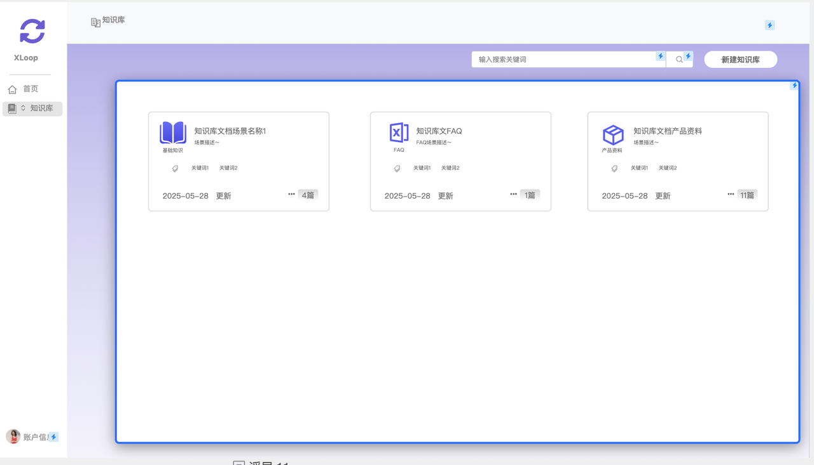

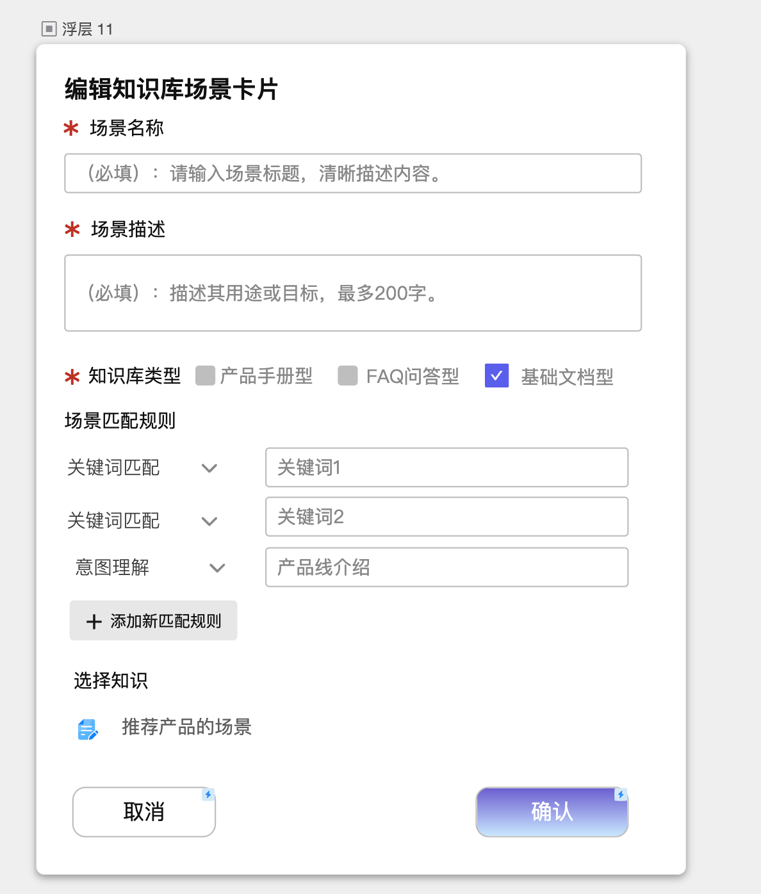

---

## 页面 4

步骤 3：选择知识库类别
步骤5:确认新建（界面及文件夹属性）
阶段 4：上传知识库文件
1. 用户文件夹卡片任意位置进入文件上传界面，不同类型的文件夹对应的不同的上传结构
系统展示一个必选项分类面板，用户需点击选择知识库类型：
●
可能的选项示例：产品手册型、FAQ 问题答复型、基础文档型等。
鼠标悬停在分类选项时显示简要说明（例如："FAQ适用于常见问题管理""产品手册用
于管理所有产品品类数据""基础文档中包音频、图片等多种文档格式"）。
若用户未选择但尝试跳过，弹出提示信息如“请选择一种知识库类型”。
○
○
○
点击添加新增匹配关键词
可以在后续卡片界面中编辑窗口下点击修改
步骤4:建构匹配规则
●
默认这是可选操作，允许跳过。
○
○

全部填写完成后，用户需要点击确认新建，返
回到知识库面板上
●
自动排列规则： 不同类型文件夹的优先级排列（默认
先显示 FAQ 型，再到产品手册型，最后是基础文档
型），同类型排序按更新时间由近到远
●
产品手册型永远展示在前列，然后FA
Q 问题答复型，最后是基础文档型
同一类型文件夹卡片按照更新（新建）时
间从近到远排列，即更近更新排列在前
新建文件夹第一次点击进入前，卡片右上
角显示“new”或者“新建”
卡片上显示知识库名称、知识库简介、文
件夹类型、关键词标签、最新更新日期、
修改文件夹属性按钮“···”以及当前文件夹下
有几篇文档
○
○
○
○

4 / 10

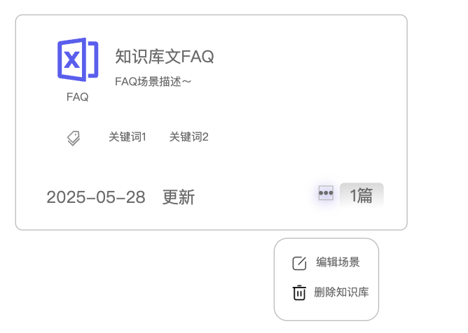

---

## 页面 5

若文件类型不匹配或文件过大，显示错误原因并引导重新上传。
上传文件后会将上传的文件自动按照状态为正在使用中的产品名称做切片
维护产品后可以通过点击文件刷新按钮批量刷新
点击每一产品名称行中任意位置，显示产品详情数据
在产品详情页可以对数据来源进行删减以及关联
可以在此页面下查看切片详
产品手册型点击页面中部新增
产品
●
在右侧文件列表中上传文件

○


○
用户点击文件列表中任意一
行数据后展示该行关联的 源
文件pdf  URL ，支持用户
直接访问。
文件上传入口：支持拖
拽和点击按钮上传，系
统动态显示上传进度
条。
■
■


●
●
●
●
●
待确认
5 / 10

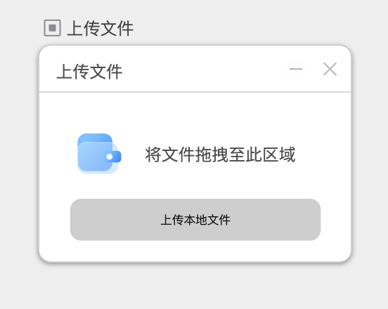

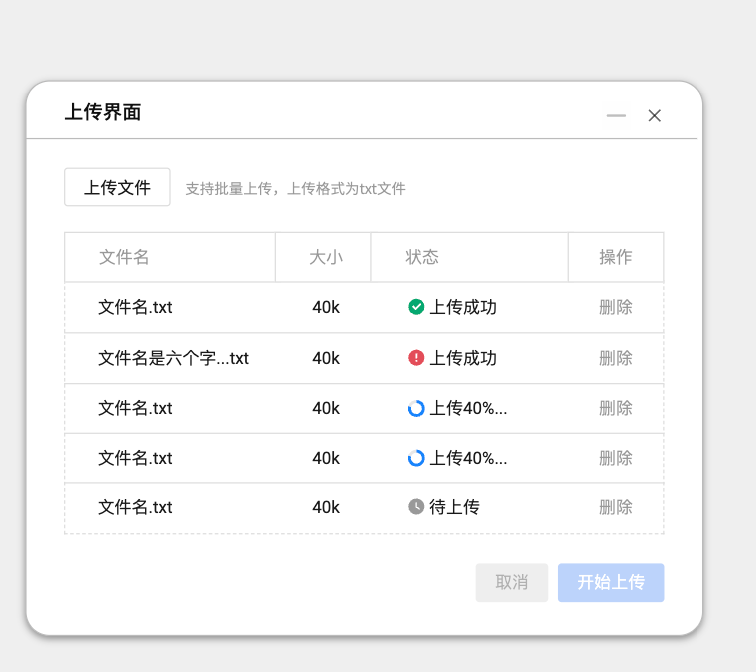

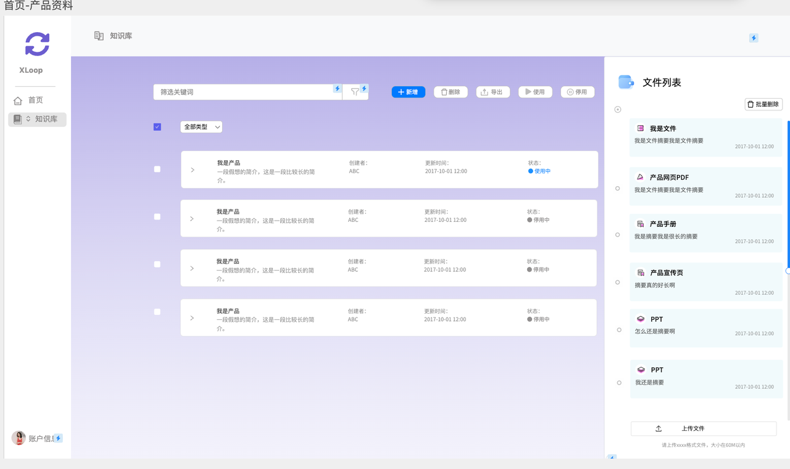

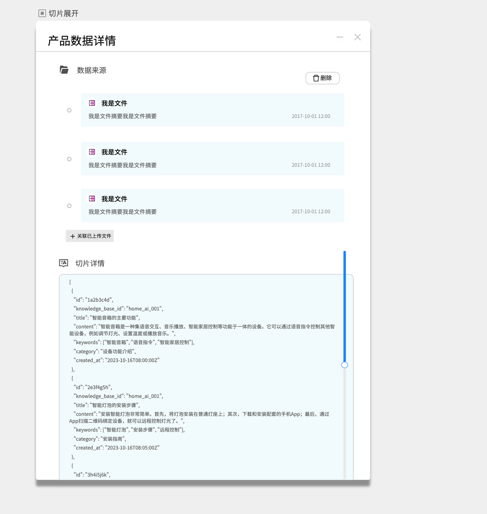

---

## 页面 6

FAQ 问题答复型支持逐条新增、批量导入、多选导出、多选删除，支持关键词搜索
基础文档型支持上传和删除，可以逐条数据点击查看详情，支持在详情页删除文件
文件ID：基础知识的唯一标识，便于追溯和管理。
文件名：上传文件名支持重命名。
文件描述 (AIGC)：对该知识文件内容的文字描述，AIGC自动生成不支持编辑。
切片展示：文件内容的切片部分内容。
创建人 / 创建日期：记录知识条目的创建人和创建时间。
1. 提示用户支持的文件格式和大小限制：
提示文字：上传初始化知识文件（支持PDF、TXT、DOCX文件，单个文件不可超过50
MB）。
左侧顶部功能 按钮
●
新增 FAQ：点击右上角
新增
按钮，可以创建新的 FAQ 问题及其答案。
导入导出：提供 FAQ 文件的批量导入和导出功能，适用于大规模数据操作。
批量删除：通过表格左侧的复选框，选定条目后点击删除按钮进行批量删除。
○
○
○
FAQ 数据以表格形式呈现，支持分页和排序。具体字段包括：FAQID、标准问题（必填）、标准问题
（必填）答案（必填），记录 FAQ 的创建者以及创建时间。记录 FAQ 的创建者以及创建时间。
●
操作： 提供 “编辑” 功能，进入单条 FAQ 内容变更的编辑页面
○


支持的文件类型与技术处理：
●
上传格式支持： CSV、PDF、PPT、TXT、MP3 等，满足不同知识输入场景的需求。
●
●
●
●
●
●
操作：点击查看详情或者本条数据任意位置显示切片详情页。
●
支持切片详情页内删除文件
○
6 / 10

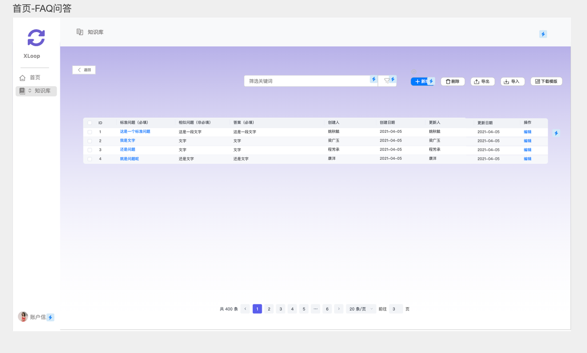

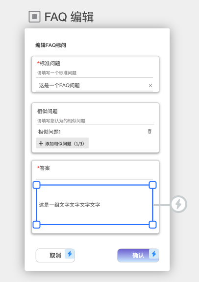

---

## 页面 7

阶段 5：进入聊天界面，开始使用知识库
本页面支持单独分享体验使用
支持查看删除对话
支持查看收藏对话



对话列表管理功能：
●
列表展示：按时间顺序列出所有对话记录。
搜索支持：允许通过关键词快速筛选对话标题或内容。
新增：点击「+ 创建新对话」，生成新的空白对话。
编辑：修改对话标题，支持更符合需求的命名方式。
删除：删除选中的对话，移除与之相关的内容记录。
○
○
○
○
○
多轮实时对话支持：
●
输入内容后点击箭头发送，消息会即时出现在对话框中。
支持 Shift + Enter 换行，优化长文本输入体验。
支持显示响应时间即模式开始生成对话的时间与对话结束的时间
支持多模型选择
○
○
○
○
对话详情展示：
●
左侧选择某条对话后，右侧会展示其完整历史内容，包括时间和消息内容。
历史内容会按顺序排列，方便用户追溯交互逻辑。
○
○
●
●
●
7 / 10

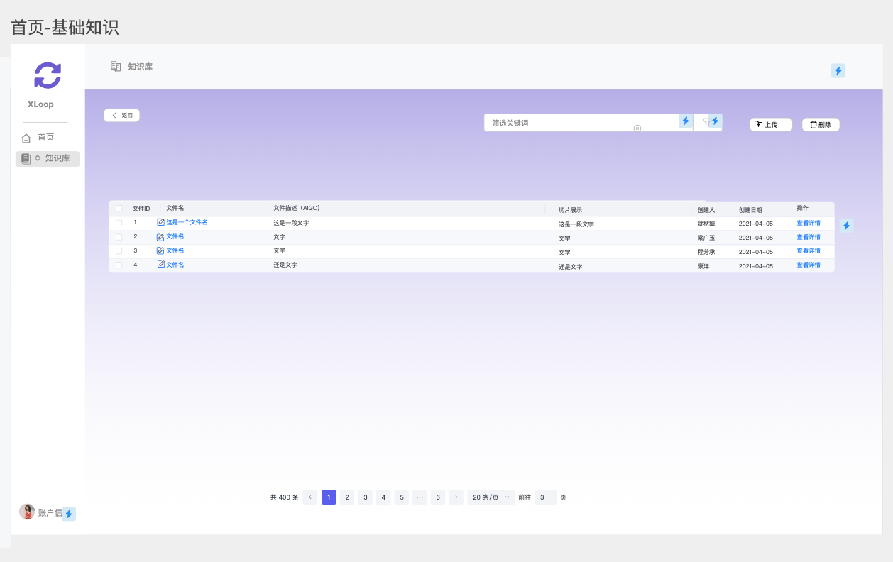

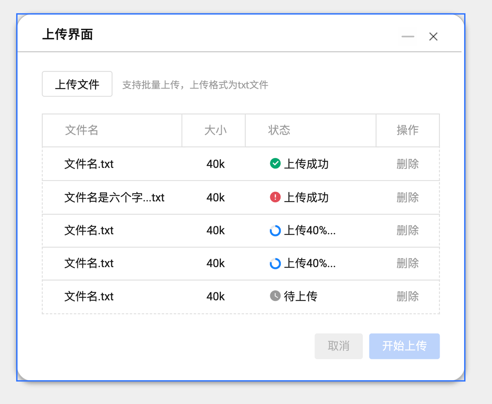

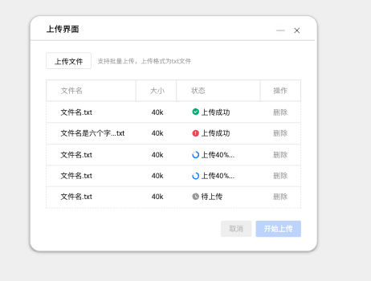

---

## 页面 8

阶段6:调优
功能模块分类切换：
●
左上侧提供功能模块切换，“客户端”和“工作端”按钮用于切换不同数据维度。
客户端是指在“在线对话”界面下的对话记录，“工作端”是指端侧设备的对话记录
○
○
表格数据展示：
●
表格展示设备对话数据，包括 设备ID、会话ID、会话日期、问题、召回答案、数据质量（标记为
"好"、"需调整" 等）、相关 操作 按钮和 自定义标签。
用户可通过日期筛选器、设备筛选器等工具筛选和聚焦目标对话数据。
顶部快速筛选按钮（“今天”、“最近一周”、“最近一个月”）和“自定义日期”条件过滤。
○
○
○
操作与调优：
●
召回答案评估：
○
通过表格的“数据质量”列按钮，用户可以进行对答案的评价（“答案
良好”，或“需优化”）并启动调优流程。
该评判标准在设置中维护

■
■
教师提示词


自定义标签按钮：
○
8 / 10

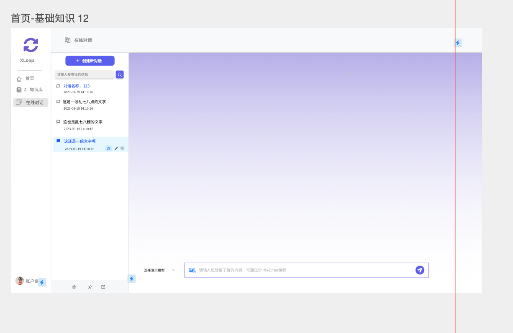

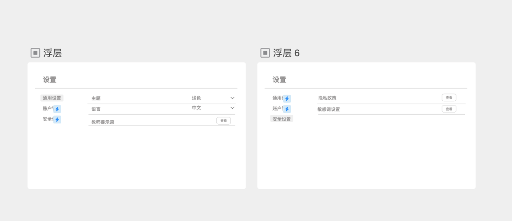

---

## 页面 9

调优分为：识别问题-检索知识-回答结果的调优
四、用户旅程
快速为对话添加或修改标签，标签操作支持浮窗优化。
■
功能快捷操作：
○
每条记录的操作列提供快捷按钮（如查看详情/调优详情）。
■
FAQ提取：
○
FAQ提取逻辑与在知识库中新增一条faq一致
■



202506052002.mermaid
1.5KB
9 / 10

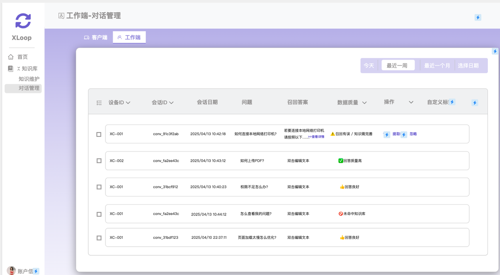

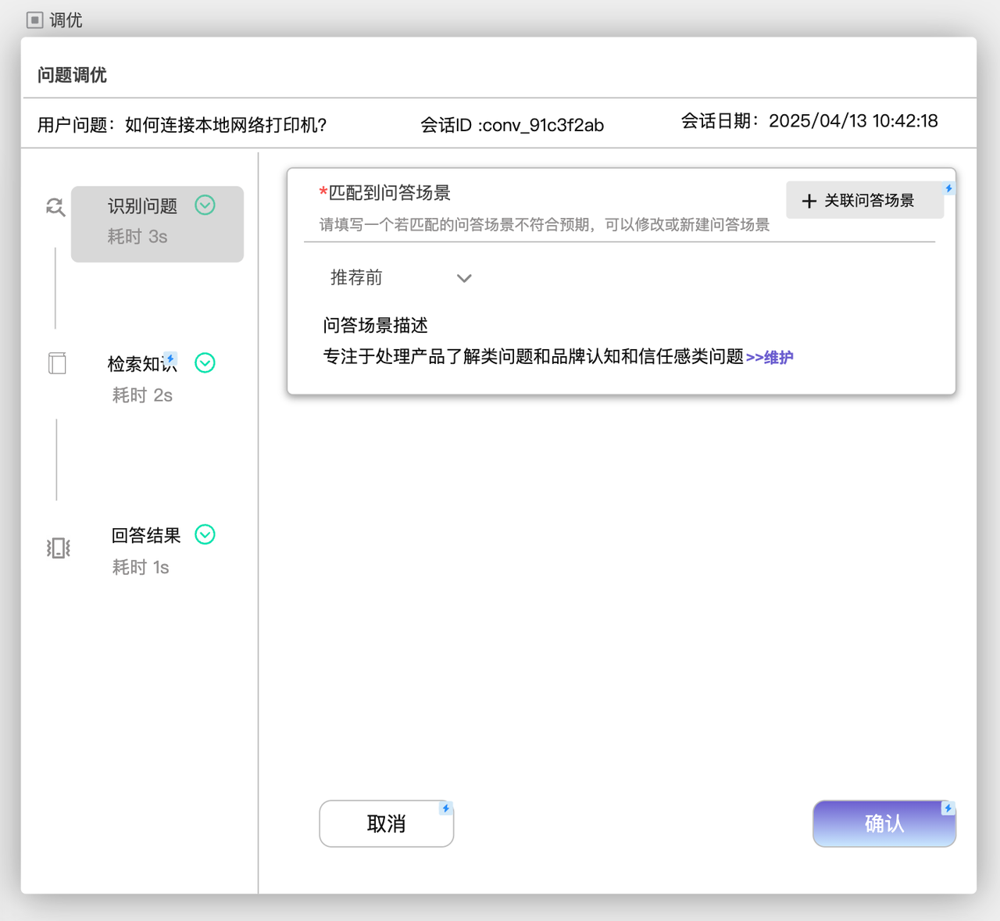

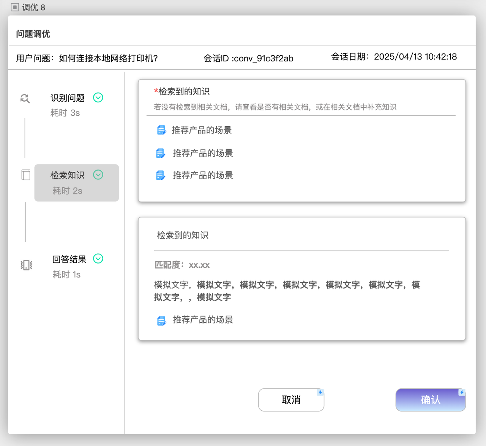

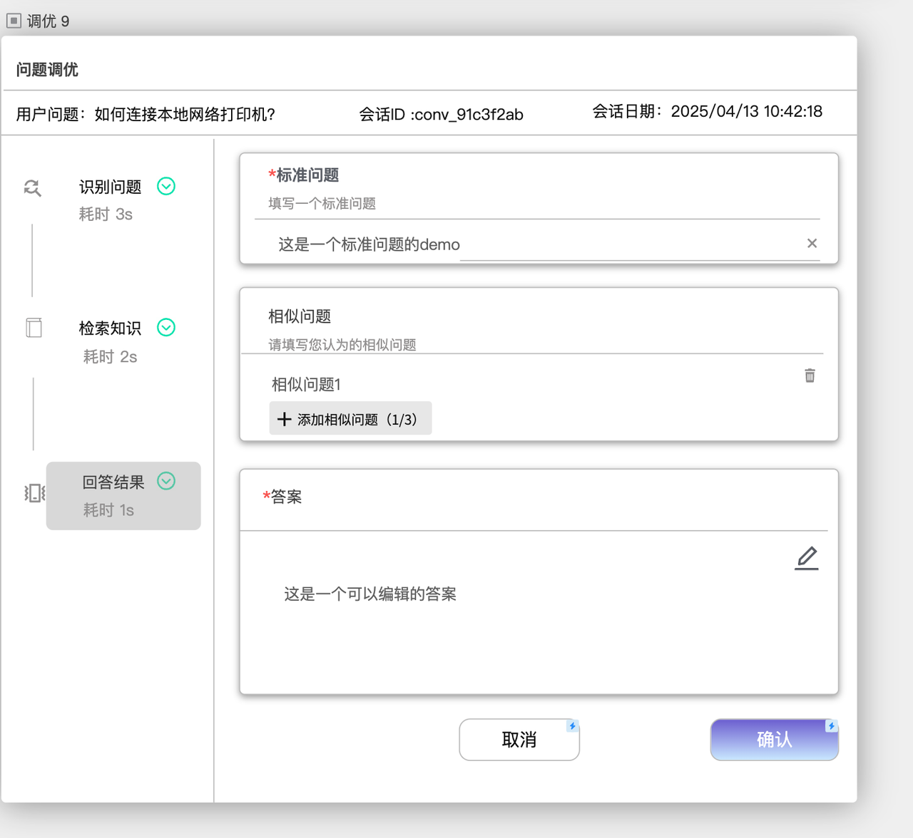

---

## 页面 10

知识库
后台系统
界⾯UI
知识库
后台系统
界⾯UI
知识库已创建，\n但没有上传内容！
部分回答不够精准，系统提⽰优化
⽤户
登录平台
1
验证⽤户⾝份
2
返回登录成功结果
3
显⽰欢迎界⾯
4
点击「新建知识库」
5
提⽰填写知识库名称和描述
6
输⼊名称「售后⽀持知识库」并提交
7
创建新知识库请求
8
创建知识库成功
9
知识库创建成功通知
10
点击「添加⽂档」上传⽂件
11
⽂件解析请求 (PDF, Word 等)
12
提交解析结果
13
⽂件解析成功，内容已切⽚
14
点击「知识调试」，发起知识点测试
15
⽤户输⼊问句请求
16
检索知识库内容
17
检索到的最佳答案
18
返回回答内容
19
显⽰对话结果
20
点击「调优」，修改召回内容并重训练
21
提交优化后的知识更新
22
优化成功通知
23
对话功能使⽤完成
24
⽤户
10 / 10

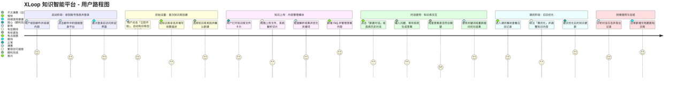

---
